# План оптимизации MassRenderer с использованием URP Core RP Library

## Текущее состояние проекта

### Архитектура
- **MassRenderer** — основной класс рендеринга через `Graphics.RenderMeshIndirect` (Multi-Draw Indirect)
- **FrustumCuller** — GPU frustum culling через compute shader (3 dispatch: Reset → Cull → UpdateArgs)
- **VAT** — Vertex Animation Textures для анимации на GPU
- **URP 17.3.0** (Unity 6), Core RP Library 15.0

### Выявленные узкие места

1. **`Graphics.CopyBuffer`** в каждом кадре для передачи draw args после culling
2. **GC-аллокации** в `ExtractFrustumPlanes` — `GeometryUtility.CalculateFrustumPlanes` создаёт `Plane[]` каждый кадр
3. **Отсутствие Occlusion Culling** — только frustum culling, нет отсечения по перекрытию
4. **Отсутствие LOD** — все инстансы рендерятся с одинаковой детализацией независимо от расстояния
5. **Избыточные `SetBuffer` вызовы** каждый кадр в `UpdateInstancesBuffers()`
6. **Шейдеры: повторное чтение InstanceData** во фрагментном шейдере через buffer read
7. **`GetMaxScale` вычисляется для `_CullGlobalTransform` на каждый инстанс** в compute shader, хотя он одинаков для всех
8. **Нет DepthPrepass** для Unlit/SimpleLit шейдеров — overdraw при большом количестве инстансов
9. **`ComputeBuffer` вместо `GraphicsBuffer`** — упущена возможность использовать более новые API

---

## План оптимизации

### 1. Замена ComputeBuffer на GraphicsBuffer с правильными Target-флагами

**Проблема:** Используются устаревшие `ComputeBuffer`. В URP Core 15.0+ рекомендуется `GraphicsBuffer` с явным указанием `Target`.

**Решение:**
- Заменить все `ComputeBuffer` на `GraphicsBuffer` с флагами `Target.Structured`
- Для draw args использовать `Target.IndirectArguments | Target.Structured` — это позволит напрямую записывать из compute shader без промежуточного staging буфера
- Для visible output использовать `Target.Structured | Target.Raw` при необходимости byte-address доступа

**Файлы:**
- `MassRenderer.cs` — `_instanceDataBuffer`, `_instancesIdOffset`, `_vatClipsDataBuffer`
- `FrustumCuller.cs` — `_visibleOutputBuffer`, `_visibleCountBuffer`, `_prototypeOffsetsBuffer`, `_segmentToPrototypeBuffer`

### 2. Устранение Graphics.CopyBuffer — прямая запись в IndirectArgs из compute

**Проблема:** Текущий pipeline: compute → staging buffer → `Graphics.CopyBuffer` → draw args buffer. Лишний копирующий шаг каждый кадр.

**Решение:**
- Создать `_multiDrawCommandsBuffer` с флагами `IndirectArguments | Structured` 
- В compute shader `UpdateDrawArgs` напрямую записывать в этот буфер
- Удалить `_stagingDrawArgsBuffer` и `_originalDrawArgsBuffer` 
- Хранить original args в отдельном `Structured`-only буфере, а staging заменить прямой записью в IndirectArgs

**Файлы:**
- `FrustumCuller.cs` — удалить staging, переделать BindBuffers
- `MassRenderer.cs` — изменить `SetCommandsBuffer` target-флаги
- `FrustumCulling.compute` — изменить запись в draw args

### 3. Устранение GC-аллокаций в ExtractFrustumPlanes

**Проблема:** `GeometryUtility.CalculateFrustumPlanes(camera)` аллоцирует новый `Plane[6]` каждый кадр.

**Решение:**
- Использовать перегрузку `GeometryUtility.CalculateFrustumPlanes(Matrix4x4, Plane[])` с предаллоцированным массивом
- Закэшировать `Plane[] _cachedPlanes = new Plane[6]` в поле класса
- Вычислять VP-матрицу: `camera.projectionMatrix * camera.worldToCameraMatrix`

**Файлы:**
- `FrustumCuller.cs` — метод `ExtractFrustumPlanes`

### 4. Вынос globalScale из per-instance вычислений в compute shader

**Проблема:** `GetMaxScale(_CullGlobalTransform)` вызывается для каждого инстанса, хотя глобальная матрица одна.

**Решение:**
- Вычислить `globalScale` на CPU и передать как uniform `float _GlobalScale`
- В compute shader использовать готовое значение

**Файлы:**
- `FrustumCuller.cs` — добавить `SetFloat` при `SetGlobalTransform`
- `FrustumCulling.compute` — заменить `GetMaxScale(_CullGlobalTransform)` на uniform
- `FrustumCullingShaderIDs.cs` — добавить ID

### 5. Distance-based LOD в compute shader

**Проблема:** Все инстансы рендерятся с максимальной детализацией.

**Решение:**
- Добавить distance-based culling — скрывать инстансы за пределами максимальной дистанции
- Добавить поле `_MaxRenderDistance` в `MassRendererParams`
- В compute shader после frustum-теста добавить distance-тест от камеры
- Подготовить инфраструктуру для LOD-switching, если меши будут иметь несколько LOD-уровней

**Файлы:**
- `FrustumCulling.compute` — добавить distance check
- `FrustumCuller.cs` — передать позицию камеры и max distance
- `MassRendererParams.cs` — добавить `MaxRenderDistance`
- `FrustumCullingShaderIDs.cs` — добавить IDs

### 6. Оптимизация шейдеров — устранение повторного чтения буфера во фрагменте

**Проблема:** Во фрагментном шейдере повторно читается `_InstanceDataBuffer[index]` для получения `textureSkinIndex`. Это дополнительный buffer read на каждый пиксель.

**Решение:**
- Передать `textureSkinIndex` из vertex shader во fragment shader через `flat`/`nointerpolation` varying
- Убрать чтение `_InstanceDataBuffer` и `_InstanceIdOffset` из фрагментного шейдера

**Файлы:**
- `MDI_Unlit.shader` — изменить Varyings, Vert, Frag
- `MDI_SimpleLit.shader` — аналогично
- `MDI_Lit.shader` — аналогично

### 7. Добавление DepthOnly pass для Unlit и SimpleLit шейдеров

**Проблема:** Unlit и SimpleLit шейдеры не имеют `DepthOnly` pass. При большом количестве перекрывающихся инстансов URP не может оптимально использовать depth prepass для early-z rejection.

**Решение:**
- Добавить `DepthOnly` pass с `LightMode = DepthOnly` в Unlit и SimpleLit шейдеры
- Минимальный vertex shader, только позиция, без освещения

**Файлы:**
- `MDI_Unlit.shader` — добавить DepthOnly pass
- `MDI_SimpleLit.shader` — добавить DepthOnly pass

### 8. Оптимизация InstanceData — упаковка данных

**Проблема:** Текущий `InstanceData` занимает 80 байт (4+4+4+4+64). При 100K инстансов это 8MB только на instance data.

**Решение:**
- Упаковать `MeshIndex` и `TextureSkinIndex` в один `uint` (по 16 бит каждый)
- Упаковать `AnimationIndex` и `AnimationSpeed` в один `uint` (16 бит index + 16 бит half-precision speed)
- Итого: с 80 байт до 72 байт (-10%), экономия ~800KB на 100K инстансов
- Рассмотреть замену `float4x4` на `float3x4` (позиция + поворот + масштаб без последней строки 0,0,0,1) — экономия 16 байт, итого 56 байт (-30%)

**Файлы:**
- `InstanceData.cs` — изменить структуру
- `FrustumCulling.compute` — обновить struct и распаковку
- Все `.shader` файлы — обновить struct и распаковку
- `CrowdSimulation.compute` — обновить struct

### 9. Async GPU Readback для отладки / профилирования

**Проблема:** Нет механизма для получения количества видимых инстансов без блокировки GPU.

**Решение:**
- Использовать `AsyncGPUReadback.Request` из URP Core для неблокирующего чтения `_visibleCountBuffer`
- Добавить опциональный debug-режим в `MassRendererParams`
- Полезно для профилирования и автоматической настройки параметров

**Файлы:**
- `FrustumCuller.cs` — добавить async readback
- `MassRendererParams.cs` — добавить debug flag

### 10. CommandBuffer-based rendering вместо Graphics.RenderMeshIndirect

**Проблема:** `Graphics.RenderMeshIndirect` выполняется немедленно на main thread. Нет контроля над порядком исполнения относительно SRP rendering pipeline.

**Решение:**
- Использовать `CommandBuffer` + `DrawMeshInstancedIndirect` или интеграцию через `ScriptableRenderPass`
- Это позволит рендерить инстансы в правильном месте SRP pipeline
- Обеспечит корректную работу с depth prepass, shadow maps, и post-processing

**Файлы:**
- Новый файл: `MassRendererRenderPass.cs` — custom ScriptableRenderPass
- Новый файл: `MassRendererRenderFeature.cs` — ScriptableRendererFeature для регистрации pass
- `MassRenderer.cs` — рефакторинг Render() для работы через CommandBuffer

---

## Диаграмма текущего vs оптимизированного pipeline

```mermaid
flowchart TD
    subgraph current[Текущий Pipeline]
        A1[CPU: ExtractFrustumPlanes - GC alloc] --> B1[GPU: Reset Counters]
        B1 --> C1[GPU: FrustumCull - вычисляет globalScale per-instance]
        C1 --> D1[GPU: UpdateDrawArgs - staging buffer]
        D1 --> E1[CPU: Graphics.CopyBuffer - staging to indirect]
        E1 --> F1[CPU: Graphics.RenderMeshIndirect]
        F1 --> G1[GPU: Vertex - read InstanceData]
        G1 --> H1[GPU: Fragment - read InstanceData ПОВТОРНО]
    end

    subgraph optimized[Оптимизированный Pipeline]
        A2[CPU: ExtractFrustumPlanes - zero alloc] --> B2[GPU: Reset Counters]
        B2 --> C2[GPU: FrustumCull + Distance Cull - globalScale uniform]
        C2 --> D2[GPU: UpdateDrawArgs - ПРЯМО в IndirectArgs]
        D2 --> F2[CommandBuffer: DrawMeshInstancedIndirect]
        F2 --> G2[GPU: Vertex - read packed InstanceData]
        G2 --> H2[GPU: Fragment - flat varying, NO buffer read]
    end
```

## Приоритет реализации

| # | Задача | Влияние | Сложность |
|---|--------|---------|-----------|
| 1 | Устранение GC-аллокаций в ExtractFrustumPlanes | Высокое | Низкая |
| 2 | Устранение повторного чтения буфера во фрагменте | Высокое | Низкая |
| 3 | Вынос globalScale из per-instance | Среднее | Низкая |
| 4 | Устранение Graphics.CopyBuffer | Высокое | Средняя |
| 5 | Замена ComputeBuffer на GraphicsBuffer | Среднее | Средняя |
| 6 | DepthOnly pass для Unlit/SimpleLit | Среднее | Низкая |
| 7 | Distance-based culling | Высокое | Средняя |
| 8 | Упаковка InstanceData | Среднее | Высокая |
| 9 | CommandBuffer-based rendering | Высокое | Высокая |
| 10 | Async GPU Readback | Низкое | Низкая |
